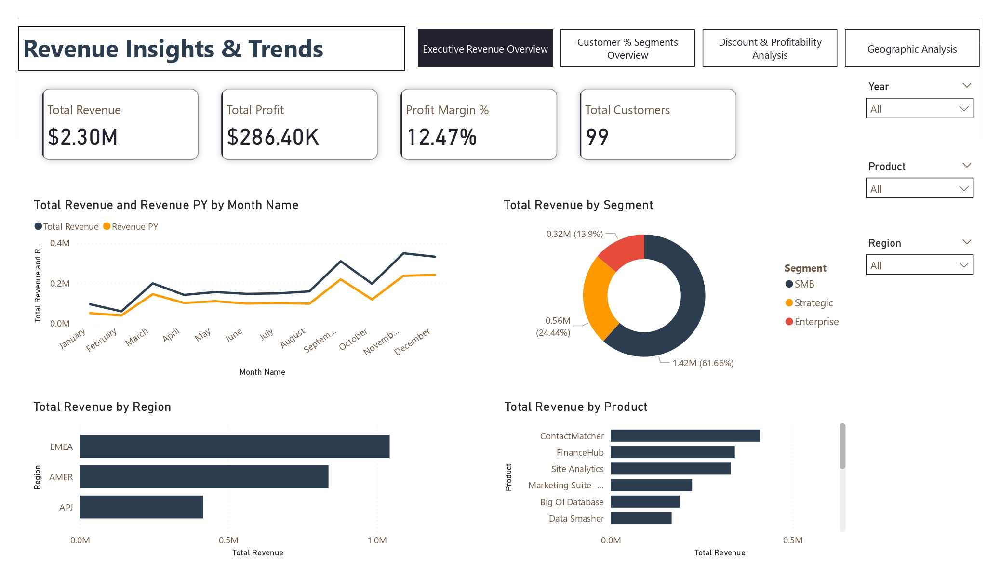
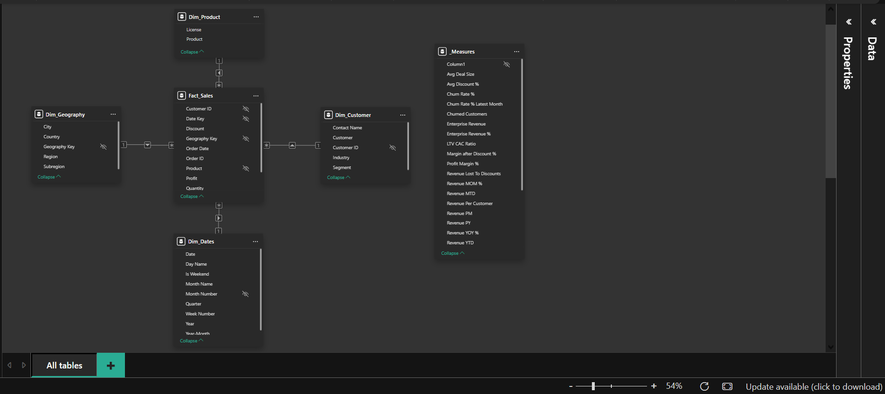

# SaaS Revenue Intelligence Dashboard
### Power BI · AWS SaaS Sales Dataset · 4-Page Interactive Report

---

## Business Problem
SaaS businesses live and die by a handful of metrics — revenue growth,
customer churn, and whether their sales team is discounting deals into
unprofitability. This project builds a production-grade analytics dashboard
that gives sales, finance, and regional leadership a single source of truth
across all four dimensions.

---

## Dataset
- Source: AWS SaaS Sales Dataset (Kaggle)
- Records: [9994] transactions across [99] customers
- Coverage: [48] countries · [3] regions · [14] products
- Date range: [2020] – [2023]

---

## Data Challenges Solved
- Mixed date formats (MM/DD/YYYY and DD/MM/YYYY) resolved by deriving
  Order Date from the unambiguous YYYYMMDD Date Key column using M code
- Staging query pattern implemented to prevent dimension table errors
  when fact table columns are removed
- Geography surrogate key engineered by concatenating Country, City,
  Region and Subregion to enable clean one-to-many relationships
- Churn Rate derived entirely from purchase history using DAX —
  no churn column existed in the source data

---

## Data Model
Star schema with 1 fact table and 4 dimension tables.

| Table | Type | Key |
|---|---|---|
| Fact_Sales | Fact | Row ID |
| Dim_Customer | Dimension | Customer ID |
| Dim_Product | Dimension | Product |
| Dim_Geography | Dimension | Geography Key |
| Dim_Date | Dimension | Date |

---

## DAX Measures (16 total)
**Core:** Total Revenue · Total Profit · Profit Margin % · Avg Deal Size
**Customer:** Total Customers · Revenue per Customer · Churn Rate % ·
             Enterprise/SMB/Strategic Revenue
**Time Intelligence:** Revenue YoY % · Revenue MoM % · Revenue YTD ·
                      Revenue MTD · Revenue PY
**Discount:** Avg Discount % · Revenue Lost to Discounts ·
             Margin After Discount % · LTV:CAC Ratio (What-If)

---

## Report Pages

### Page 1 — Revenue Overview
KPI cards · Revenue trend vs prior year · Segment mix ·
Regional & product breakdown · Year slicer

### Page 2 — Customer & Segment Analysis
Churn rate trend · Segment comparison · Top 10 customers ·
Industry breakdown · Drillthrough to customer detail

### Page 3 — Discount & Profitability
Discount vs margin scatter · Revenue lost to discounts ·
Margin by segment before/after discount · LTV:CAC What-If slider

### Page 4 — Geographic Analysis
Revenue bubble map by country · Regional bar charts ·
Segment and year slicers · Cross-filtering by country click

---

## Key Findings
1. **[Despite three active regions, APJ trails significantly in both revenue and profit margin, signaling an underperforming market that needs strategic attention]**
2. **[The Small and Medium Business (SMB) segment is the primary engine of the company, contributing 61.66% ($1.42M) of the total revenue.]**
3. **[Product ContactMatcher shows the highest discount rate at an average of 35% while generating the highest total revenue]**

---

## Enterprise Features Implemented
- Row Level Security (3 region-based roles: AMER · EMEA · APJ)
- Scheduled data refresh via OneDrive connection
- Data alert configured on Churn Rate % threshold
- Custom AWS-aligned theme (JSON)
- Page navigation bar across all pages
- Drillthrough from any page to customer detail

---

## Tools & Skills
Power BI Desktop · Power Query (M language) · DAX ·
Power BI Service · Row Level Security · Star Schema Modeling ·
Data Cleaning · Time Intelligence · What-If Parameters

---

## How to Use
1. Download `SaaS_Product_Analytics.pbix`
2. Open in Power BI Desktop (free at powerbi.microsoft.com)
3. Data is embedded — no additional setup needed
4. Use the navigation bar to move between pages
5. Hold Ctrl and click any visual to cross-filter

▶ [Watch the 3-minute walkthrough](YOUR_LOOM_LINK_HERE)